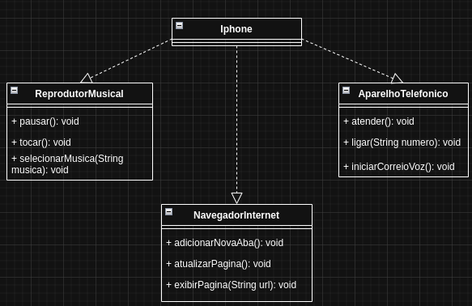

# Desafio POO (Modelagem de um Iphone)
Olá mundo!!👋🏻   
Este é o meu repositório para apresentar o projeto da modelagem de um iphone📱🍎 em um diagrama de classes e posteriormente portando-o para um software desenvolvido em linguagem Java☕.

## UML
### Diagrama de Classes

